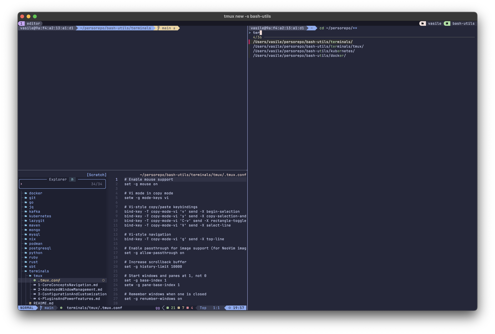

# herdr image check (image.nvim → herdr → WezTerm)

Open this file in nvim **inside a herdr pane** and in a tmux pane for comparison:

```sh
nvim ~/persorepo/bash-utils/terminals/herdr/image-test.md
```

Expected: the screenshot below renders inline. Pass = it renders, stays put
while scrolling, and disappears when the buffer is closed or you switch tabs.



If nothing renders, check in order:

1. `:checkhealth image` inside the herdr pane.
2. `[terminal] kitty_graphics = true` in `~/.config/herdr/config.toml` (default is true).
3. `echo $TERM $TERM_PROGRAM` inside the pane, and compare with the tmux pane.
